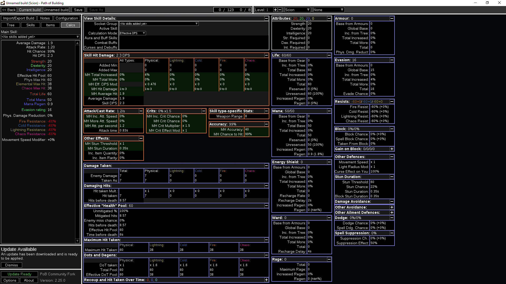

# UI Recreation

In this project, I've challenged myself to recreate UIs from non web based software using HTML and CSS. Below are the original UIs, followed by my recreated versions.

## Path of Building:
Original

[Recreation](https://ncky.github.io/ui-recreations/pob/)
[More indepth recreation using React](https://github.com/ncky/ui-recreations/tree/master/pob-react)

<!-- ## UI 2: [Original UI](link-to-original-ui) | [Recreated UI](link-to-recreated-ui)

 -->

## Conclusion

Recreating these interfaces using HTML and CSS was of great benefit to improving my skills. I learned a lot about the intricacies of UI design and how to use CSS to create visually appealing, scalable and functional user interfaces.
